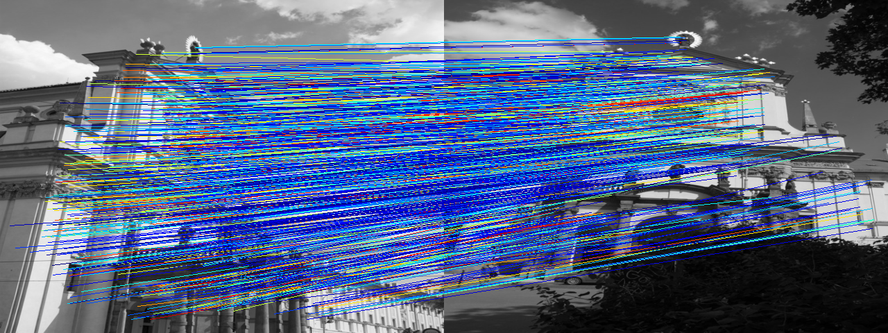

# efficientloftr-onnx-rs

Rust ONNX Runtime wrapper for EfficientLoFTR-style semi-dense matching.

## Demo

<table>
  <tr>
    <td align="center"><strong>Kornia reference</strong></td>
    <td align="center"><strong><code>efficientloftr-onnx-rs</code> generated</strong></td>
  </tr>
  <tr>
    <td></td>
    <td></td>
  </tr>
</table>

The left image is the Kornia LoFTR reference demo. The right image is generated in this repository using the same
`kn_church-2.jpg` and `kn_church-8.jpg` pair used by the Kornia/LoFTR tutorials.

## Status

This repository is working end to end for ONNX inference in Rust.

Validated paths:

- Single-pair inference with the `eloftr_640x480.onnx` model and Kornia `kn_church` sample pair
- Sequence/frame-pair evaluation on the LoFTR ScanNet-756 demo clip using `eval_video_frames`

Current scope:

- The implementation is validated with ONNX exports that follow common EfficientLoFTR output conventions and aliases
- Inputs should match the exported model's expected resolution (for the validated sample model: `640x480`)

## What this provides

- Native Rust library API for running ONNX inference on image pairs
- CLI for quick matching experiments
- Automatic fallback for common ONNX tensor names used by LoFTR/EfficientLoFTR exports (for example `mkpts0_f`, `mkpts1_f`, `mconf`)
- Flexible manual tensor-name overrides when a model uses custom names

## Build

```bash
cargo build --release
```

## Quality and linting

This repository uses:

- `rustfmt` for formatting
- `clippy` for linting (`-D warnings`)
- `cargo test` for test validation
- GitHub Actions CI in `.github/workflows/ci.yml`

Run all local quality checks with:

```bash
just ci
```

or manually:

```bash
cargo fmt --all -- --check
cargo clippy --all-targets --all-features -- -D warnings
cargo test --all-targets --all-features
```

## CLI usage

```bash
cargo run --release -- \
  --model /path/to/efficient_loftr.onnx \
  --image0 /path/to/image0.png \
  --image1 /path/to/image1.png \
  --output-json /tmp/matches.json
```

Quick smoke test:

```bash
cargo run --release -- \
  --model samples/eloftr_640x480.onnx \
  --image0 samples/kn_church-2-640x480.jpg \
  --image1 samples/kn_church-8-640x480.jpg
```

Optional tensor names:

- `--input0-name` (default: `image0`)
- `--input1-name` (default: `image1`)
- `--keypoints0-name` (default: `keypoints0`)
- `--keypoints1-name` (default: `keypoints1`)
- `--confidence-name` (default: `confidence`)

## Verified sample run (loftr-rs pair)

This repository has been validated with the same `kn_church` image pair referenced in `loftr-rs`:

```bash
mkdir -p samples
curl -L --fail -o samples/eloftr_640x480.onnx \
  https://huggingface.co/zahilaty/EfficientLoFTR-ONNX/resolve/main/eloftr_640x480.onnx
curl -L --fail -o samples/kn_church-2.jpg \
  https://github.com/kornia/data/raw/main/matching/kn_church-2.jpg
curl -L --fail -o samples/kn_church-8.jpg \
  https://github.com/kornia/data/raw/main/matching/kn_church-8.jpg

# The ONNX file above expects 640x480 inputs
sips -z 480 640 samples/kn_church-2.jpg --out samples/kn_church-2-640x480.jpg
sips -z 480 640 samples/kn_church-8.jpg --out samples/kn_church-8-640x480.jpg

cargo run --release -- \
  --model samples/eloftr_640x480.onnx \
  --image0 samples/kn_church-2-640x480.jpg \
  --image1 samples/kn_church-8-640x480.jpg \
  --output-json samples/matches.json
```

Generate the repository demo image from the same pair:

```bash
mkdir -p docs/images

# Optional: copy the Kornia reference panel used in loftr-rs docs
cp /path/to/loftr-rs/docs/images/kornia-matching-loftr.jpg docs/images/kornia-matching-loftr.jpg

cargo run --release --bin render_demo -- \
  --model samples/eloftr_640x480.onnx \
  --image0 samples/kn_church-2.jpg \
  --image1 samples/kn_church-8.jpg \
  --output docs/images/efficientloftr-onnx-rs-demo.png \
  --width 640 \
  --height 480 \
  --top-k 1500 \
  --max-matches 4096
```

## ScanNet video-style evaluation (LoFTR project clip)

The LoFTR project page includes a ScanNet sequence clip (`scene0756`) used for qualitative evaluation. You can run this matcher over consecutive frames:

```bash
mkdir -p samples/videos
curl -L --fail -o samples/videos/loftr_scene0756_00_slow.mp4 \
  https://zju3dv.github.io/loftr/images/loftr_scene0756_00_slow.mp4

# On macOS, use Homebrew ffmpeg path to avoid Linux binary conflicts in /usr/local/bin.
/opt/homebrew/bin/ffmpeg -y \
  -i samples/videos/loftr_scene0756_00_slow.mp4 \
  -vf "fps=4,scale=640:480" \
  samples/videos/scene0756_frames/frame_%05d.jpg

cargo run --release --bin eval_video_frames -- \
  --model samples/eloftr_640x480.onnx \
  --frames-dir samples/videos/scene0756_frames \
  --output-csv outputs/scannet756_matches.csv
```

This writes per-pair counts to `outputs/scannet756_matches.csv` and prints summary statistics (mean/min/max/p10/p50/p90).

Example short run with uncapped output checks:

```bash
cargo run --release --bin eval_video_frames -- \
  --model samples/eloftr_640x480.onnx \
  --frames-dir samples/videos/scene0756_frames \
  --max-pairs 20 \
  --max-matches 4096 \
  --output-csv outputs/scannet756_matches_20_max4096.csv
```

## Known limitations

- Different ONNX exports may use non-standard tensor names or different preprocessing assumptions.
- Very high-quality adjacent video frames may saturate `--max-matches`; increase the cap when evaluating recall behavior.
- This project currently focuses on inference and match extraction, not full geometric verification (RANSAC/homography/pose).

## Contributing

See `CONTRIBUTING.md` for local development and pull request expectations.

## Library sketch

```rust
use efficientloftr_onnx_rs::{EfficientLoftrConfig, EfficientLoftrMatcher, GrayscaleFrame};

let cfg = EfficientLoftrConfig::default();
let mut matcher = EfficientLoftrMatcher::from_model_path("model.onnx", cfg)?;
let image0 = GrayscaleFrame::from_path("a.png")?;
let image1 = GrayscaleFrame::from_path("b.png")?;
let matches = matcher.match_pair(&image0, &image1)?;
println!("{} matches", matches.confidence.len());
# Ok::<(), Box<dyn std::error::Error>>(())
```
